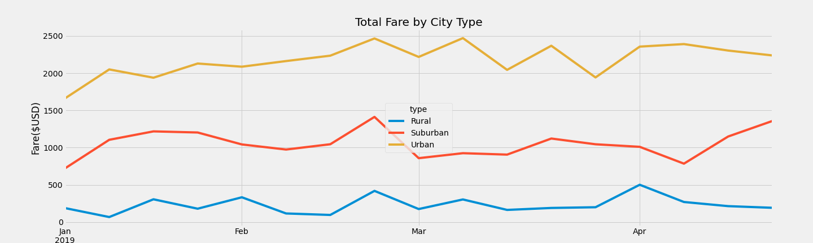

# PyBer_Analysis

## Overview 
---
- Created a summary DataFrame of the ride-sharing data by city type
- Using `Pandas` and `Matplotlib`, created a multiple-line graph that shows the total weekly fares for each city type

## Results
---
There are three city types:
`Rural`, `Suburban` and `Urban`

### Total Rides:
- `Total Rides` in `Rural`: 125
- `Total Rides` in `Suburban`: 625
- `Total Rides` in `Urban`: 1625

*Total Rides* in *Urban* city type is more as compare to other types, `Urban>Suburban>Rural`. We can see that *Rural* has the least total rides.
#### Total Drivers
- `Total Drivers` in `Rural`:78
- `Total Drivers` in `Suburban`: 490
- `Total Drivers` in `Urban`: 2405

*Total Driver Counts* are more in *Urban* as compare to other types

#### Total fares by City Type ($USD)
- `Total Fares` in `Rural`: $4327.93
- `Total Fares` in `Suburban`: $19,356.33
- `Total Fares` in `Urban`:$39,854.38

*Total Fares by City Type* is more in *Urban*
#### Average Fare per Ride ($USD)
- `Average Fare per Ride` in `Rural`: $34.62
- `Average Fare per Ride` in `Suburban`: $30.97
- `Average Fare per Ride` in `Urban`: $24.53

Although the *number of rides* and *drive counts* are less in *Rural*, but we can see that the *Average Fare per Ride* is more as compare to other city types

#### Average Fare per Driver ($USD)
- `Average Fare per Driver` in `Rural`: $55.49
- `Average Fare per Driver` in `Suburban`: $39.50
- `Average Fare per Driver` in `Urban`: $16.57

## Summary
---
 </img>

- In the month of April `Total Fare` decreases in the `Urban` city type
- In the beginning of the month of April, there was a slight decrease in the `total fare` but then it started to increase in the middle of the month for `Suburban` city type
- In `Rural`, it has been steady trend 
- Also, we can see that the trend is almost similar in all `Urban` and `Suburban` city types by month, gradual increase in January and then the slight dip in March
